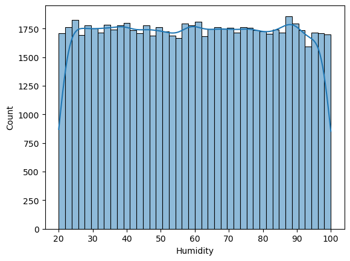
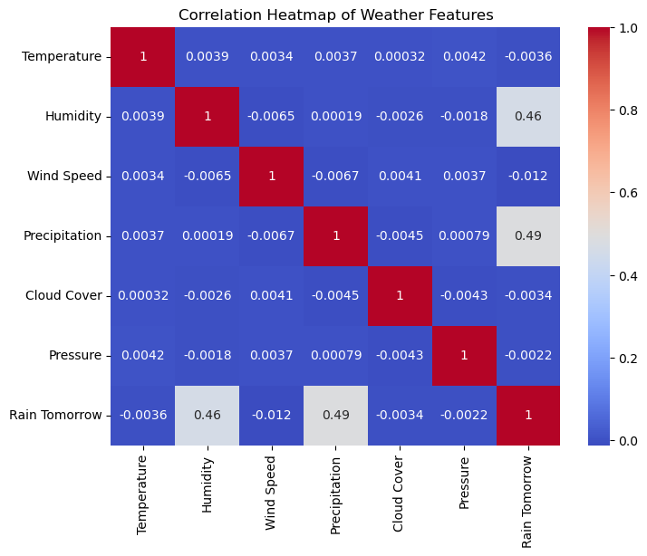
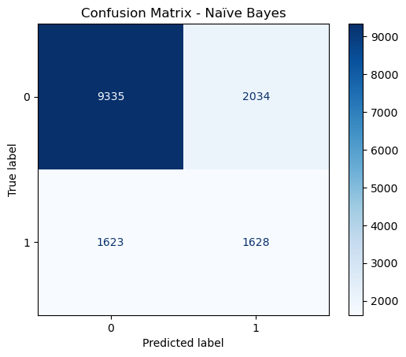
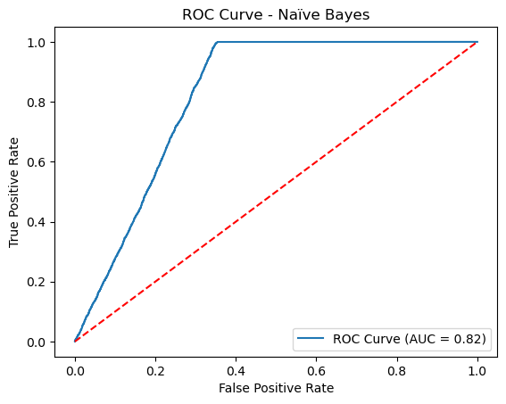

# 🌦️ Weather Forecast Prediction

📌 **Overview**  
This project uses **Naïve Bayes Classification** to predict whether it will rain tomorrow based on weather features such as humidity, temperature, wind speed, and pressure.  
The model applies **Gaussian Naïve Bayes** since the features are continuous values.

It uses Python with:

- **Pandas** → data handling  
- **Matplotlib / Seaborn** → visualization  
- **Scikit-learn** → model building and evaluation  

---

## 🚀 Usage  

1. Open the `weather.ipynb` notebook in Jupyter Notebook or JupyterLab.  
2. Run the cells step by step to:  
   - Load and explore the weather dataset  
   - Perform Exploratory Data Analysis (EDA)  
   - Train a Naïve Bayes classifier  
   - Evaluate accuracy and make predictions  

👉 You can also try the **Streamlit App** here:  
🔗 [Rainfall Prediction App](http://localhost:8501/)  

### 📸 Feature Distribution


### 📸 Correlation Matrix


### 📸 Confusion Matix


### 📸 ROC curve



---

## 📊 Results  

### 🌡️ Feature Distributions  
Visualized in a **2x2 grid (center aligned)** for better clarity:

- Humidity (%)  
- Temperature (°C)  
- Wind Speed (km/h)  
- Pressure (hPa)  

```python
import matplotlib.pyplot as plt

features = ['humidity', 'temperature', 'wind_speed', 'pressure']

plt.figure(figsize=(10, 8))

for i, feature in enumerate(features, 1):
    plt.subplot(2, 2, i)
    df[feature].hist(bins=30, edgecolor='black')
    plt.title(f'{feature.capitalize()} Distribution')

plt.tight_layout()
plt.show()

## ✅ Conclusion
- **Humidity** and **pressure** were found to be the most influential features in predicting rainfall.  
- The **Naïve Bayes classifier** provides a simple yet effective approach for weather forecasting with tabular data.  
- While accuracy is moderate, the model can serve as a baseline for comparison with more advanced classifiers like Decision Trees, Random Forests, or Gradient Boosting.  
- Future improvements can include:
  - Adding more weather-related features (e.g., cloud cover, dew point, seasonality)  
  - Using a larger dataset across multiple regions and seasons  

---

💡 *Feel free to fork this repo and test the model on your own weather dataset!*  
